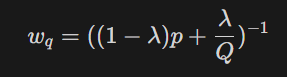

# Landscape colorization using CNN

This project is developed in the context of the lecture "194.077 Applied Deep Learning" form the TU Wien. 

**Author**: Grégoire de Lambertye   
**Mat.number**: 12202211

_This project aims to use convolutional neural network to colorize landscape images._ 

To run the test, download model_1.pth from the release "final model for Assignment 2 ADL" and place it in the folder "models".
Use python version 3.7.2 (cuda 10.1 and cudnn 7.6.5)

## Table of contents

+ [Introduction](#Introduction)
+ [Dataset](#dataset)
+ [Evaluation](#evaluation)
+ [Results](#results)
+ [Work-breakdown structure](#work-breakdown-structure)
+ [Realisation](#realisation)
  + [About Color](#about-color)
    + [Color space](#color-space)
    + [Color classes](#color-classes)
  + [CNN architecture](#cnn-architecture)
  + [Loss function](#loss-function)
  + [Color rebalancing](#color-rebalancing)
  + [Probablitity to color](#probablitity-to-color)
+ [Models](#models)
+ [Additional information](#additional-information)
+ [References](#references)

## Introduction

Image colorization is a popular topic in the field of image processing, and despite the substantial 
amount of effort invested in research, there always seems to be room for improvement.

The paper **Colorful Image Colorization** from Zhang et al [[1]](#references) showed a great improvement in image 
colorization using a clever idea of color categorization and re-balancing classes. It inspired a 
lot Chen et al for the paper **Image Colorization Algorithm Based on Deep Learning** [[2]](#references) where they 
improved the neuron network architecture and used different activation functions. In practise they 
focused on faces colorization what inspired this project with the idea of using deep learning to 
train a colorization cnn specialized in landscapes. 

## Dataset 

During the course of this project, 3 datasets were considered:

1. 'Landscape Pictures from Rougetet Arnaud' dataset, available on Kaggle [here](https://www.kaggle.com/datasets/arnaud58/landscape-pictures). This comprehensive dataset comprises 7 folders, totaling 4300 landscape pictures. These folders encompass various landscapes such as general scenery, mountains, deserts, seas, beaches, islands, and specific scenes from Japan.
2. 'Landscape Recognition | Image Dataset | 12k Images', available on Kaggle [here](https://www.kaggle.com/datasets/utkarshsaxenadn/landscape-recognition-image-dataset-12k-images'). This dataset comprises 12,000 landscape pictures, divided into 5 categories: Coast, Desert, Forests, Glaciers and Mountains.
3. 'LHQ dataset', available on Yandex Disk [here](https://disk.yandex.ru/d/HPEEntpLv8homg). This dataset comprises 90'000 images of (mostly) landscapes. I used the preprocessed set _LHQ1024 resized to 256x256 with Lanczos interpolation_.

The preprocessing and image split will be described in the final report.

## Evaluation

As discussed in Zhang et al paper [[1]](#references) there is no perfect metric for our task this is mostly due to the different colors an object or anything can take. 
We would prefer a model that colorize with coherent color over a model that would partially colorize with the truth color.

|  |  |  |
|------------------------------------------------------------------|--------------------------------------------------------------------|---------------------------------------------------------------------|
| Truth Image                                                      | Coherent Colorization                                              | Uncoherent Colorization                                             |

_credit image https://cc.porsche.com/_

To evaluate our prediction we will therefore use the 2 same metrics as Wang, N. et al [[2]](#references) and a user evaluation:

+ **Euclidean distance** : The euclidean distance is the average distance between the predicted color and the real color.
   
    For a 256x256 pxl image

+ **PSNR** : The PSNR is the peak signal-to-noise ratio. It is a measure used to compare the quality of an image with the original image.
  
    

The objective is to beat Zhang et al [[1]](#references) model on a testing dataset containing landscapes images regarding these metrics.

##  Results

I end up with 3 models based on the same architecture, their implementation is slightly discussed in the section [Models](#models).

### Metrics

The test set correspond of 3000 images from the LHQ dataset.:

<table>
  <tr>
    <th rowspan="2">Model</th>
    <th colspan="2">Euclidean distance</th>
    <th colspan="2">PSNR</th>
  </tr>
  <tr>
    <th>mean</th>
    <th>std</th>
    <th>mean</th>
    <th>std</th>
  </tr>
  <tr>
    <td>Zhang et al</td>
    <td>799.74</td>
    <td>363.77</td>
    <td>-9.16</td>
    <td>3.58</td>
  </tr>
  <tr>
    <td>model_1</td>
    <td>970.18</td>
    <td>428.14</td>
    <td>-10.97</td>
    <td>3.15</td>
  </tr>
  <tr>
    <td>model_2</td>
    <td>1258.47</td>
    <td>377.63</td>
    <td>-13.51</td>
    <td>2.45</td>
  </tr>
  <tr>
    <td>model_3</td>
    <td>1032.374</td>
    <td>375.67</td>
    <td>-11.64</td>
    <td>2.88</td>
  </tr>
</table>

### User evaluation

I selected 10 images from the LHQ dataset and asked 10 people to compare the output of Zhang et al and Model_1. 
I selected these images aiming to show that model_1 could be better than Zhang model on some very specific cases.
The dominance of Zhang model over my model is obvious.

92 people answered a survey where they had to choose the most realistic image between te prediction of Zhang et al e16 model and Model_1.
The results are the following: 

| Ground truth                                                       | Grayscale                                                         | Zhang                                                                 | Model_1 | Score (% in favor of Model_1) |
|--------------------------------------------------------------------|-------------------------------------------------------------------|-----------------------------------------------------------------------|---------|-------------------------------|
|  |  |  |  | 95%                           |
|  |  |  |  | 84%                           |
|  |  |  |  | 65%                           |
|  |  |  |  | 51%                           |
|  |  |  |  | 44%                           |
|  |  |  |  | 42%                           |
|  |  |  |  | 26%                           |
|  |  |  |  | 14%                           |
|  |  |  |  | 1%                            |
|  |  |  |  | 1%                            |

##  Work-breakdown structure

+ Gathering information, paper lecture (4h)
+ Gathering and preparing data (6h)
+ Development of a first version of the CNN including training and environment installation (cuda) (20h)
+ Workaround to improve the model (colors classes, penalty, temperature.. ) (80h)
+ Evaluation of the final CNN including a user comparison to Zhang's CNN output (8h)
+ Redaction of a report (_h) 

## Realisation

This section is a short summary of the project.

**General concept** The usual metric while colorizing image is to use the euclidian distance between a predicted color 
and its ground truth but this usually generated grayish/sepia colors. To avoid this effect an idea is to classify the 
colors and deal with the task like a classification problem. 

### About Color

#### Color space

 

  
  
CIELAB color space

The RGB (red, green and blue) color space is usually used to encode a pixel colors but for this task we will use the L*a*b* CIE 1976 (CIELAB) color space.
The CIELAB space is composed of 3 channels: L* for lightness and a* and b* for the color components. The a* channel encodes the green-red component and the b* channel encodes the blue-yellow component.
When the conversion is possible, the transformation from CIELAB to RGB is done without loss. Since our network takes as input a grayscaled image, 
corresponding to the L channel we will stay in this color space and predict the a* and b* channels. 

#### Color classes

The classes we try to predict are the following: a bin has size 0,066 x 0,066 when a* and b* are in the range [0, 1].
The shape and choice of classes will be discussed in the report.

 

  
  
Color class for L = 50

### CNN architecture

The final architecture is a U-net with 4 layers. The input is a grayscaled image and the output is a 256x256x104 tensor encoding the probability of each pixel to be from the class.

    
    
Cu_net architecture

The following table describe the input/output dimensions of each layer with #layer x height x width.

| Layer   | Dimensions (in) | Dimensions (out)  |
| ------- | ---------------  | ------------------ |
| conv1   | 1x256x256        | 64x128x128         |
| conv2   | 64x128x128       | 128x64x64          |
| conv3   | 128x64x64        | 256x32x32          |
| conv4   | 256x32x32        | 512x16x16          |
| deconv1 | 512x16x16        | 256x32x32          |
| deconv2 | 512x32x32        | 128x64x64          |
| deconv3 | 256x64x64        | 64x128x128         |
| deconv4 | 128x128x128      | 105x256x256        |

### Loss function

Our task is a classification problem and we will therefore use a (weighted) cross entropy loss function.

### Color rebalancing

In landscapes some colors are much more present than others. Blue for sky and sea, green for trees and gras ... If we want to predict colorful images it could be interesting to weight our loss function to take into account this color distribution.
The following heat map shows the color distribution (among our classes) of around 30k images of the 3rd dataset. The central part of the image is the most present and correspond to the brown / least vibrant colors.

    
    
Empirical color distribution in the train set 3

To go from the empirical distribution to a weight we can use the following formula:

    
    
Empirical distribution to weight

Where _p_ is the empirical distribution and _q_ is a color and _Q_ the total amount of colors. 

The parameter lambda controls the influence of the empirical distribution on the final weight.

    
    
Lambda influence on the final weight (log scale)

### Probablitity to color

The output of the network is a 256x256x104 tensor encoding the probability of each pixel to be from the class. We can imagine different mapping to get to our final colorization.
Taking the most probable class for each pixel is the most obvious but it can lead to a colorization with a lot of noise and less coherence. On the opposite, taking the average of the probability for each class will lead to a more coherent colorization but with less contrast and a result similar to a model that would use euclidean loss.
To find a good balance between coherence and contrast we can use a temperature parameter. The temperature parameter is a scalar that will modify the max probability influence. The higher the temperature the more the max probability will be important.

    
    
Temperature influence

With the example above, we see that with a low temperature we obtain a very coherent image but less interesting. With a high temperature we obtain a more contrasted image but with less coherence as we can clearly see in the sky. 

## Models

The 3 models available are based one the same architecture but used different datasets and different parameters.

They all used pytorch CrossEntropyLoss as loss function and Adam as optimizer.

Due to time constraints the models couldn't be trained as long as I would have liked.

### Model_1

The first model is trained on the 2nd dataset (10k images) without penalty (labda = 1). 
Initial learning rate was set to 0.015 (no scheduler). The 15th epoch was selected as the best model.
To generate the colorization I used a temperature of 2.

### Model_2

The second model is trained on the 3rd dataset (30k/60k images[*](*)) with a penalty (lambda = 0.5). 
Initial learning rate was set to 0.015 and set to 0.005 after the 5th epoch. The training was stopped after 8 epoch.
To generate the colorization I used a temperature of 0.25.

### Model_3

The last model is similar to the 2nd, but the penalty was lowered (lambda = 0.8). 
Initial learning rate was set to 0.0015 and stayed the same over the 3 iterations.
To generate the colorization I used a temperature of 2.

*During training many difficulties were encountered. Due to my private setup (NVIDIA GEFORCE GTX 950M _ 2 GB VRAM) I opt for a training in the cloud using Google Colab (GPU T4 15GB RAM) but the execution there seemed unstable, this will be documented in the report.  .
## Additional information 

**Project type:** *beat the stars:* The aim will be to beat the CNN from the Colorful Image Colorization paper  on landscape colorization.

## References

**Paper 1:** Zhang, R., Isola, P., Efros, A.A. (2016). Colorful Image Colorization. In: Leibe, B., Matas, J., Sebe, N., Welling, M. (eds) Computer Vision – ECCV 2016. ECCV 2016. Lecture Notes in Computer Science(), vol 9907. Springer, Cham. https://doi.org/10.1007/978-3-319-46487-9_40

**Paper 2:** Wang, N.; Chen, G.-D.; Tian, Y. Image Colorization Algorithm Based on Deep Learning. Symmetry 2022, 14, 2295. https://doi.org/10.3390/sym14112295

**Dataset 1:** Rougetet Arnaud, Landscape Pictures (2020), https://www.kaggle.com/datasets/arnaud58/landscape-pictures

**Dataset 2:** DEEPNETS, Landscape Recognition | Image Dataset | 12k Images', available on Kaggle https://www.kaggle.com/datasets/utkarshsaxenadn/landscape-recognition-image-dataset-12k-images

**Dataset 3:** Skorokhodov, Ivan and Sotnikov, Grigorii and Elhoseiny, Mohamed, LHQ dataset, https://disk.yandex.ru/d/HPEEntpLv8homg, original paper: Skorokhodov, Ivan and Sotnikov, Grigorii and Elhoseiny, Mohamed. Aligning Latent and Image Spaces to Connect the Unconnectable (2021) https://arxiv.org/abs/2104.06954 

